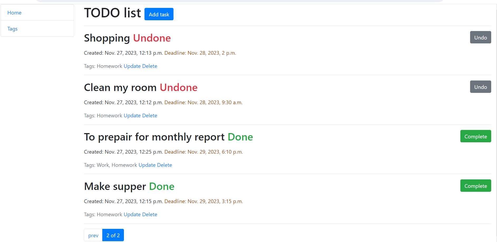

# ToDo-List project

The ToDo app is a simple task management application designed to help you organize your daily tasks and increase productivity.

## Check it out!

[NA deployed to render] (https://...)

## Installation

Python3 must be already installed

```shell
git clone https://github.com/fedorov-s-od/to-do-list/tree/main
cd to-do-list
python -m venv venv
python venv\Scripts\activate
pip install -r requirements.txt
python manage.py runserver
```

## Features

* Task Management: Add, edit, and delete tasks to keep track of your to-do list.
* User-Friendly Interface:** Intuitive and clean interface for a seamless user experience.
* Powerful admin panel for advanced managing

## Demo




# to-do-list

  - Login: `admin.user`
  - Password: `mate2023`
